# AWSome IoT Prototyping Day for INTTRA

Today we will build a completely functional, end-to-end IoT prototype of an asset tracking system using the **ESP32 HiLetGo** development board ([Find it on Amazon](https://www.amazon.com/HiLetgo%C2%AE-ESP-WROOM-32-Development-Microcontroller-Integrated/dp/B0718T232Z)).

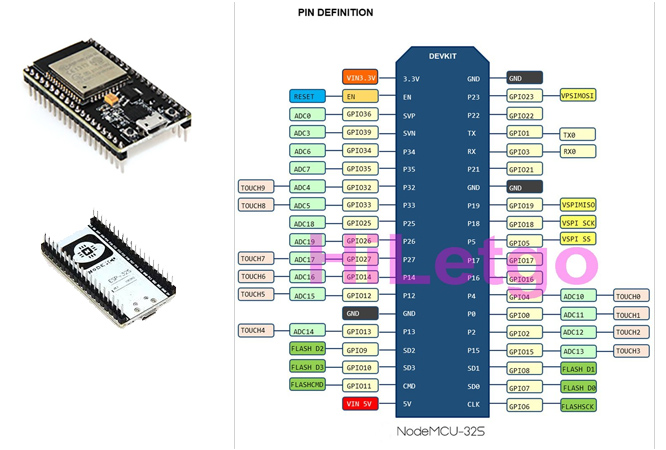

. Here are some specs:
- Hybrid Wifi/Bluetooth Chip. ESP32 can interface with other systems to provide Wi-Fi and Bluetooth functionality through its SPI / SDIO or I2C / UART interfaces.
- Built-in antenna switches, RF balun, power amplifier, low-noise receive amplifier, filters, and power management.
- ESP32 achieves ultra-low power consumption with a combination of several types of proprietary software
- ESP32 is capable of functioning reliably in industrial environments, with an operating temperature ranging from –40°C to +125°C.

We will use **AWS** to collect, store and visualize the data from the devices. The map-based dashboard will listen for state changes to the device shadow and update in near real time. Secondly, all transactions will be stored in a blockchain ledger, to provide users a definitive, unalterable history of transactions. This means, they will be able to confirm with certainty the path their shipment took (GPS Sensors), that the shipment was not tampered with (light and motion sensors) and it met environmental requirements (temperature and humidity sensors). The centralized blockchain solution we will use is **Hyperledger Sawtooth on AWS**.

## Pre-requisites

### AWS Environment

Before getting started, make sure you have access to an AWS account and have the AWS CLI installed on your development machine.

- Simple AWS CLI installation with PIP: `pip install awscli --upgrade --user`
- Windows installers: [64bit](https://s3.amazonaws.com/aws-cli/AWSCLI64.msi) | [32bit](https://s3.amazonaws.com/aws-cli/AWSCLI32.msi)

*Complete guide to installing the CLI:*
[https://docs.aws.amazon.com/cli/latest/userguide/installing.html](https://docs.aws.amazon.com/cli/latest/userguide/installing.html)

#### Configure the AWS CLI

- Create a new IAM user with the following permissions
- Attach the following policies to the IAM user: **AWSIoTFullAccess**.
- Create a set of credentials and download the credentials.
- Run `aws configure --profile proto` to create a new profile called 'proto'.
- Put in your credentials and set the region to us-east-1 and the output format to json.

```
:~ user$ aws configure --profile proto
AWS Access Key ID [None]: AFDFDFGKGLGLSKFK
AWS Secret Access Key [None]: f0f0dfkkfKFAf032ask32
Default region name [None]: us-east-1
Default output format [None]: json
```

*[Complete guide](https://docs.aws.amazon.com/IAM/latest/UserGuide/id_users_create.html) to creating IAM resources:*

### Web Development Environment

Node.JS is required to build and run the static website.
- Windows installer: [.msi](https://nodejs.org/dist/v8.11.3/node-v8.11.3-x86.msi)
- Mac installer: [.pkg](https://nodejs.org/dist/v8.11.3/node-v8.11.3.pkg) 

*[Complete guide](https://nodejs.org/en/download/) to installing node.js.*

### IoT Development Environment

#### Mongoose Tool Chain

- Install the Mongoose OS (MOS) toolchain: [OPTIONAL: For more details, click here](https://mongoose-os.com/software.html)
    - Windows: [Download (.exe)](https://mongoose-os.com/downloads/mos-release/win/mos.exe)
    - Mac:
        ```
       curl -fsSL https://mongoose-os.com/downloads/mos/install.sh | /bin/bash
        ~/.mos/bin/mos --help      
        ```

*[Complete guide](https://docs.aws.amazon.com/IAM/latest/UserGuide/id_users_create.html) to installing Mongoose:*

- Download, unzip and run the SILabs Driver installer for ESP32:
   - Windows: [Win10 Universal Download](https://www.silabs.com/documents/public/software/CP210x_Universal_Windows_Driver.zip), [Win7-10 Download](https://www.silabs.com/documents/public/software/CP210x_Windows_Drivers.zip)
   - Mac: [Download (.zip)](https://www.silabs.com/documents/public/software/Mac_OSX_VCP_Driver.zip)

*[Complete guide](https://www.silabs.com/products/development-tools/software/usb-to-uart-bridge-vcp-drivers) to installing SILabs drivers.*

Now, let's start the Mongoose development environment in your browser:
```
 ~/.mos/bin/mos
```

This should bring up the following starting screen:
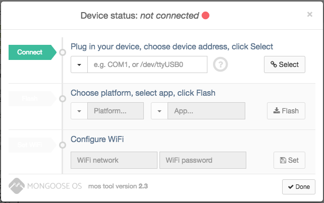

## Device Setup & Configuration

In this section, we will flash the operating system, tweak some settings and provision the device with certificates to connect to AWS.

### Flash the Device OS

- Connect to your ESP32 via your micro usb cable.
- Choose your ESP32 device and click **Select**.
  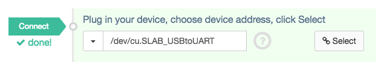

- Be sure *esp32* is the selected platform and *demo-js* is the selected app and click **Flash**.
  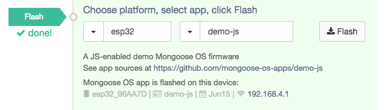

- Configure your WiFi settings by entering the WiFi network SSD and password and click **Set**.
  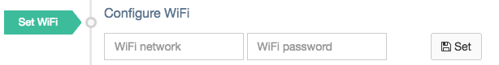
- After applying these settings click **Done**.
- You should now see rotating log messages, 'Tick' and 'Tock' in the demo application.

### Wire up your ESP with sensors. 

The example application uses both a GPS module (SIM28) that will return both altitude and geocoordinates and a digital temperature and humidity sensor (DHT22). This is what it should look like once complete:

  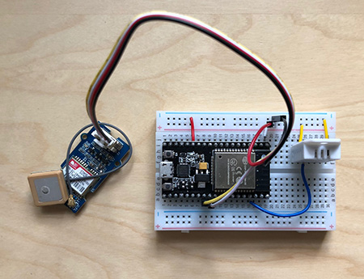

Note: If this is your first time using a breadboard, check out [this article](https://learn.adafruit.com/lesson-0-getting-started/breadboard) for some more background.

### Replace App Files
- Replace the default device **mos.yml** file from the dropdown menu with the code from **device/mos.yml**.
    - Click the *Save file, copy to device, reboot device (fast)* button after replacing the default YAML file.
    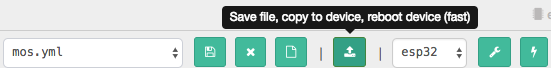

- Replace the default device **init.js** file from the dropdown menu with the code from **device/init.js**.
    - Click the *Save file, copy to device, reboot device (fast)* button after replacing the default Javascript file.
    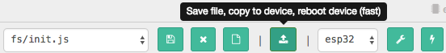

### Connect to AWS
- Navigate to the left-hand column of the Mongoose OS configuration window and click **Device Config**.

- Leave the *AWS region* box blank or select the region you would prefer and create a permissive policy automatically by typing *mos-default* in the AWS policy box.

- Click **Provision with AWS IoT** to provision this device.

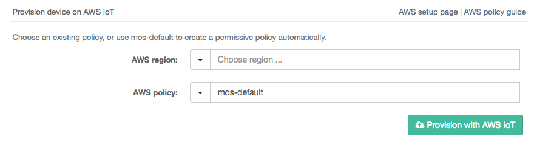

- After this completes click **Save Configuration**.


### You're Set!

After completing all of these steps, data from the ESP32 device shadow should be displaying in the Device Logs:
```
[Jun 15 16:14:19.101] mgos_aws_shadow_ev   Update: {"state": {"reported": {"humidity":null,"temperature":null,"gps":"$GPGGA,005012.798,,,,,0,0,,,M,,M,,*48\r\n$GPGSA,A,1,,,,,,,,,,,,,,,*1E\r\n$GPGSV,1,1,00*79\r\n$GPRMC,005012.798,V,,,,,0.00,0.00,060180,

```
## Building the Web Application

### Set up Cognito Identity Pool

For the subscribing web application, we will be creating a Cognito Identity Pool to authenticate and authorize the end user to get data from our endpoint.

1. Open the **Amazon Cognito** Console.
2. Click **Manage Federated Identities**
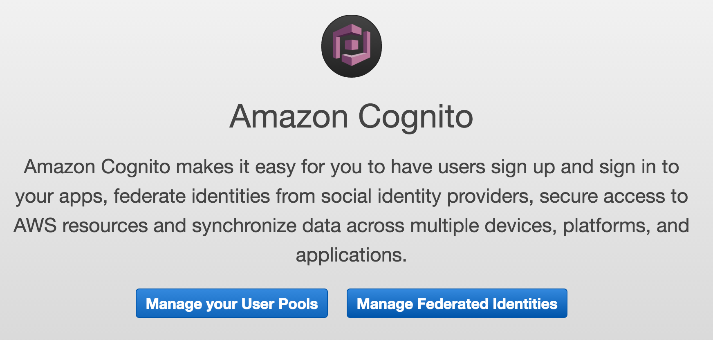
> **What is Cognito User Pools?**
> There are two flavours of Cognito. User Pools enables you to create and manage your own directory of users for your application. Federated Identities leverages an external indentity provider like Sign-in with Amazon, Facebook Login, Sign-in with Google, Twitter or any OpenID compatible directory.

3. Click **Create new identity pool**. Name your identity pool and check the box *Enable access to unauthenticated identities*.
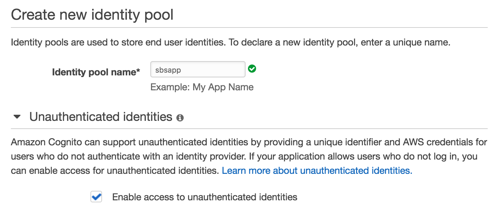
4. Click the dropdown for **Authentication Providers**. Note the different options you have here. You could link up a *Cognito User Pool*, or use one of the popular identity providers mentioned. For this bootcamp, we will not need to set this up.
5. Press **Create Pool**.
6. Next, it will bring us to a screen where we can setup the IAM roles that will be assumed by both an *Unauthenticated User* and an *Authenticated User*. Look at the policy documents to see how they are structured. Then press **Allow**.
7. The final step is to give permission to an *Unauthenticated User* to subscribe to our AWS IoT Topic. To do this, click back to the list of AWS Services and open the **AWS Identity & Access Management Console**.
8. On the left menu, click **Roles**.
9. You will see all of your roles here. There is one role titled **Cognito_<YOUR_APP_NAME>UnauthRole**. Click on this role.
10. Under *Inline Policies*, press **Create Role Policy** to create a new inline IAM policy.
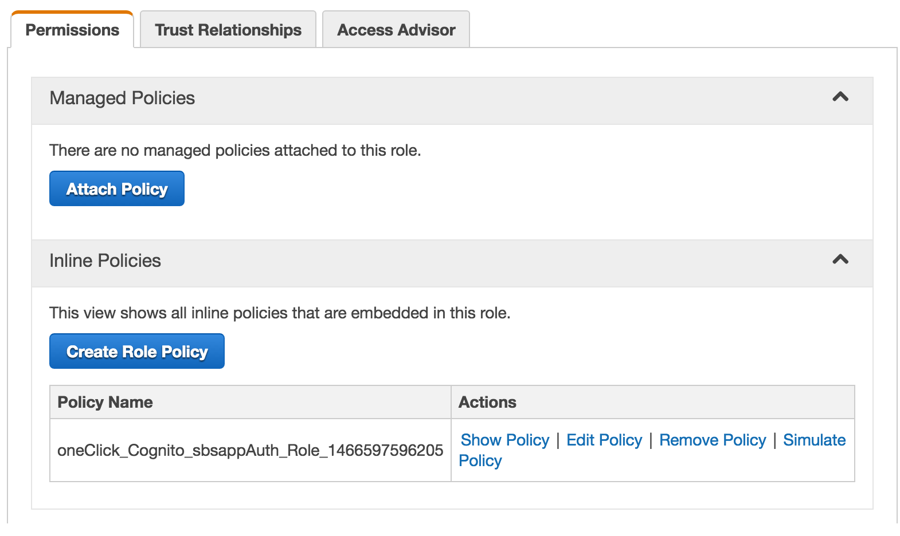
11. Select the box **Custom Policy** and press **Select**.
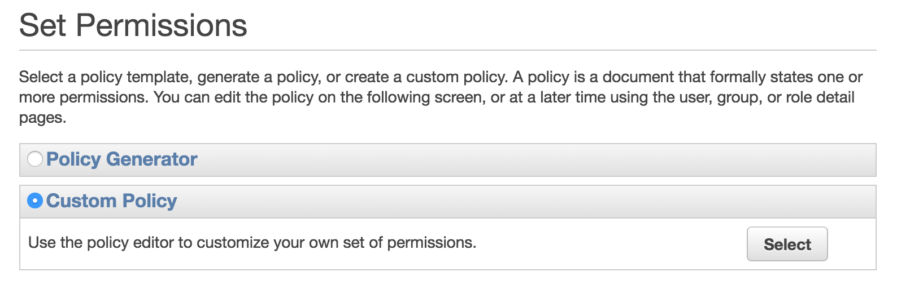
12. Name the policy and copy and paste the following JSON text. **Remember to replace <REPLACE_WITH_ACCOUNT_NUMBER> with your actual account number**.

```json
{
    "Version": "2012-10-17",
    "Statement": [
        {
            "Effect": "Allow",
            "Action": [
                "iot:Connect",
                "iot:Receive"
            ],
            "Resource": "*"
        },
        {
            "Effect": "Allow",
            "Action": "iot:Subscribe",
            "Resource": [
                "arn:aws:iot:<REGION>:<REPLACE_WITH_ACCOUNT_NUMBER>:topicfilter/sbs/*"
            ]
        }
    ]
}
```

> **Note:** Replace *<REPLACE_WITH_ACCOUNT_NUMBER>* with your actual account number and *<REGION>* with the region you are using.

13. Press **Apply Policy** and you are done!

**Congratulations! You have successfully created your Cognito Identity Pool**

### Run the website locally

For this section, we will be working out of the **frontend** directory. This is where all of the files we need to build out the static web application. First, run this command to change the directory:

```
cd <path/to/awsome-iot-day/client>
```

Before we get going, here is a quick intro to a tool called **Gulp**. Gulp is a task manager for Node.js applications. It enables us to wire up commands that will perform common tasks. Here are a few we will use today. Go ahead and try them out!

```
gulp serve
```
> This command will run a local webserver that is listening for any changes to your app directory. If there are an file changes, it will reload the local running web application. This is great for development, as you can see changes live as you update the code.
```
gulp build
```
> This command will package up all of the files you need for your static site and write them into your **/dist/** folder. This is the folder that serverless is using when it publishes your S3 static files.
```
gulp test
```
> This command will run the unit tests defined in the **/test/** folder. For this project, we have not defined any unit test.

Awesome. Now you know how to work with Gulp! Next, let's open up **app/scripts/main.js** in Atom and copy and paste your identity pool ID from Cognito. You can get this from the Cognito console.

1. Find the variable **IDENTITY_POOL_ID** and update the variable with your identity pool.
2. Find the variable **AWS.config.region** and update the variable with your region.
3. In your command line, run gulp serve.